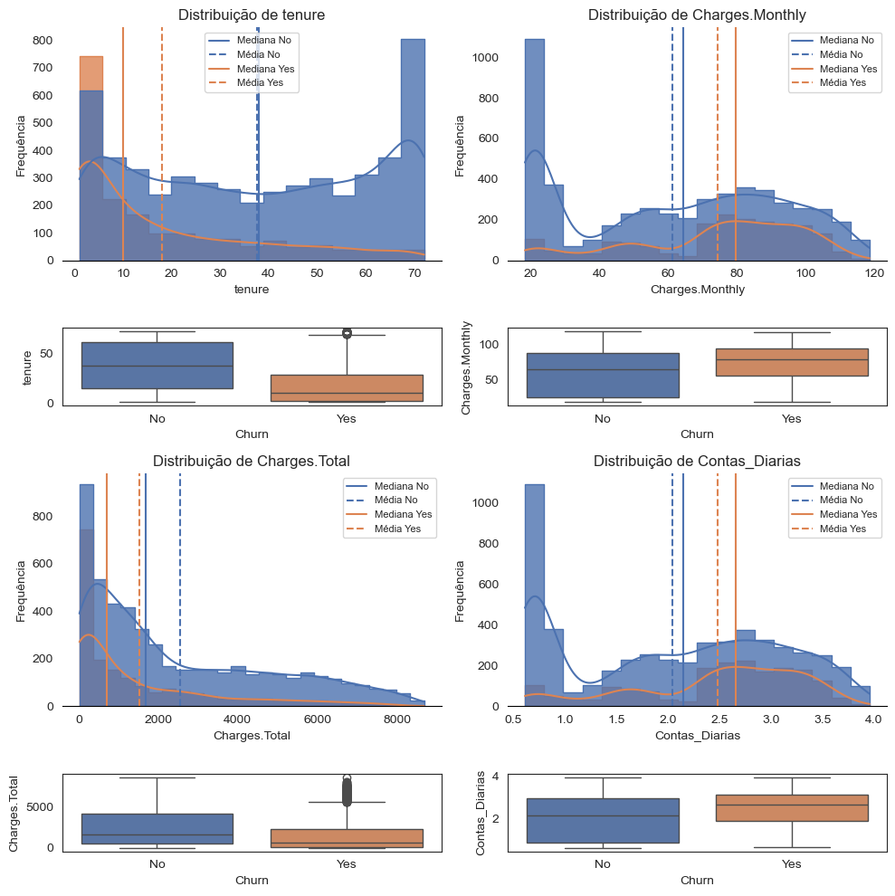

- **`app.ipynb`**: contém todas as etapas da análise.  
- **`histograma.png`**: ilustração da distribuição das variáveis em relação ao churn.  
- **`README.md`**: documentação do projeto.  

---

## 🧼 Preparação e Limpeza dos Dados

- Ajuste de variáveis categóricas e numéricas.  
- Tratamento de valores ausentes.  
- Criação de variáveis derivadas, como `Contas_Diarias`.  
- Padronização de tipos e consistência dos dados.  

---

## 📊 Análise Exploratória

Foram utilizados gráficos de barras, setores, histogramas e boxplots para avaliar:  

- Diferenças entre clientes ativos e cancelados.  
- Relação entre churn e variáveis como:  
  - Tipo de contrato  
  - Forma de pagamento  
  - Serviços adicionais (streaming, segurança, suporte)  
  - Perfil demográfico (idade, gênero)  

**Exemplo de visualização:** 

---

## 📌 Principais Descobertas

- **Contratos mensais** concentram a maior taxa de churn (~43%).  
- **Serviços extras de suporte ou segurança** aumentam a retenção.  
- **Cheque eletrônico** é o meio de pagamento mais associado ao cancelamento (~45%).  
- **Idosos com internet via fibra e fatura elevada** apresentam maior risco de evasão.  
- Clientes com **menos de 6 meses de vínculo** ou com **baixo engajamento** tendem a cancelar mais rapidamente.  

---

## ✅ Ações Recomendadas

1. Criar **incentivos para contratos de longa duração** (descontos, pacotes de benefícios).  
2. **Oferecer suporte gratuito inicial** para novos clientes.  
3. **Acompanhar de perto os primeiros 6 meses** da jornada do cliente.  
4. Migrar clientes para **formas de pagamento automáticas** (cartão/débito).  
5. **Monitorar padrões de uso diário** para identificar clientes em risco de churn.  

---

## 📌 Considerações Finais

A análise forneceu uma visão clara dos fatores relacionados à evasão de clientes e gerou recomendações estratégicas. Em etapas futuras, pode-se ampliar o estudo com **modelos preditivos de machine learning**, visando antecipar cancelamentos e reforçar ações preventivas.

---
